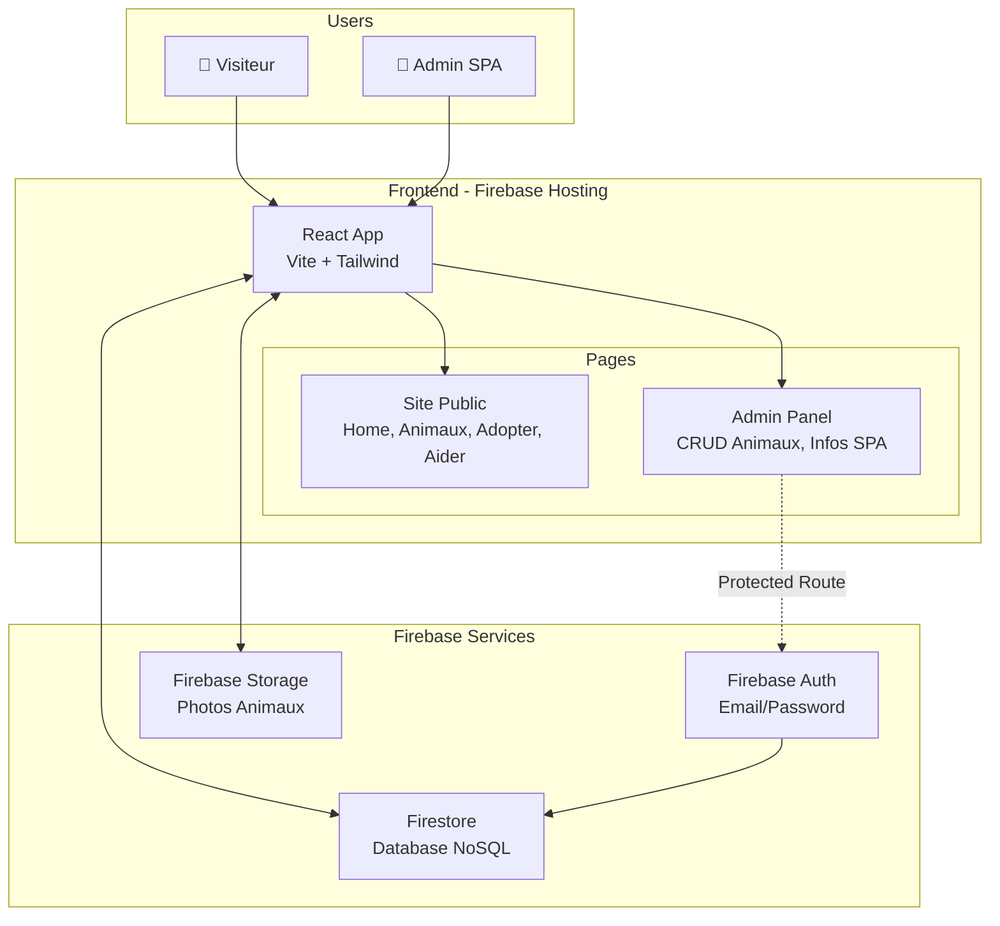
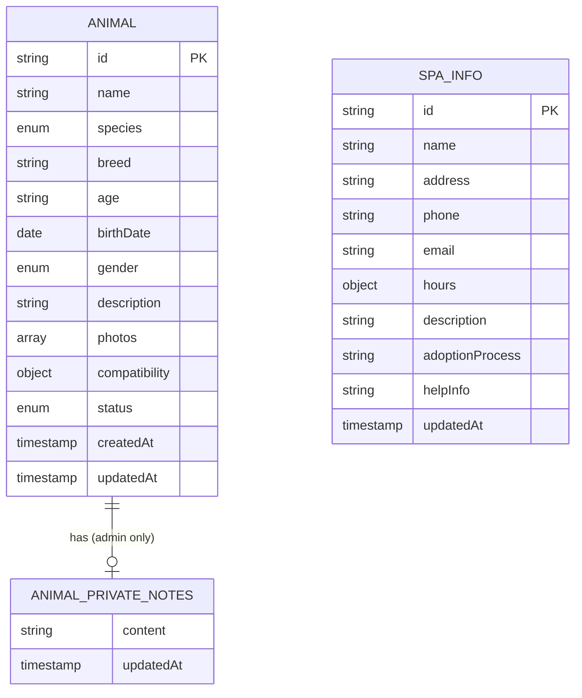
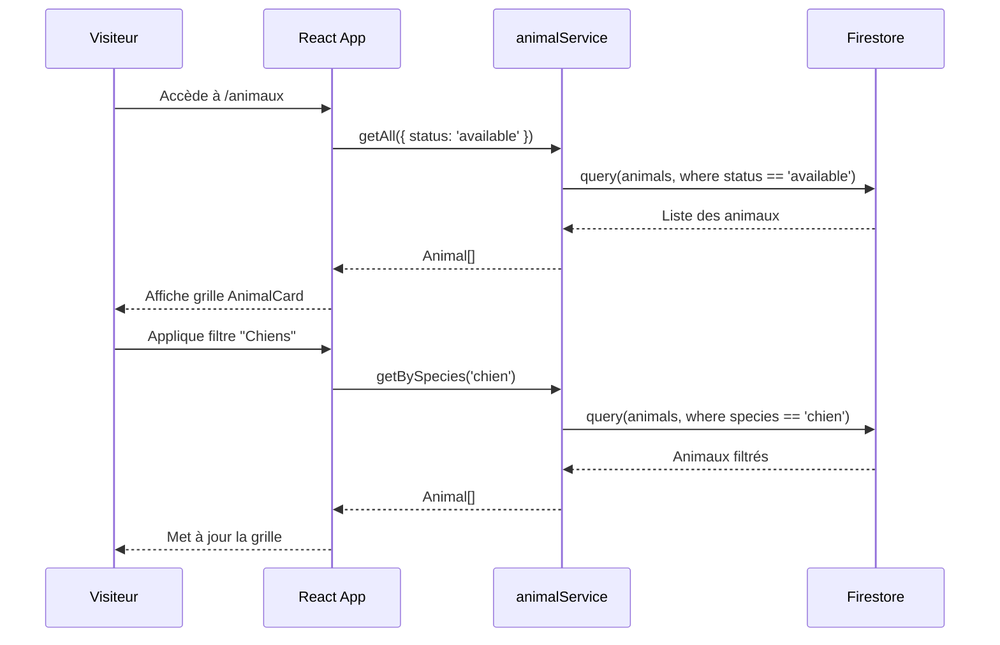
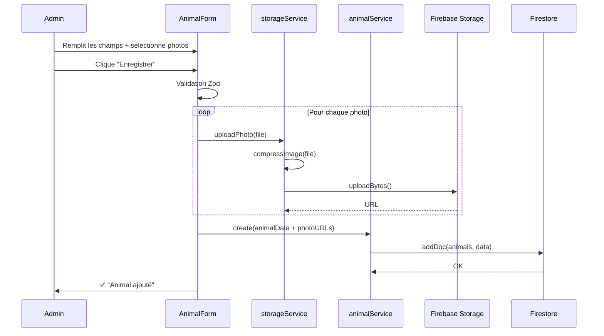
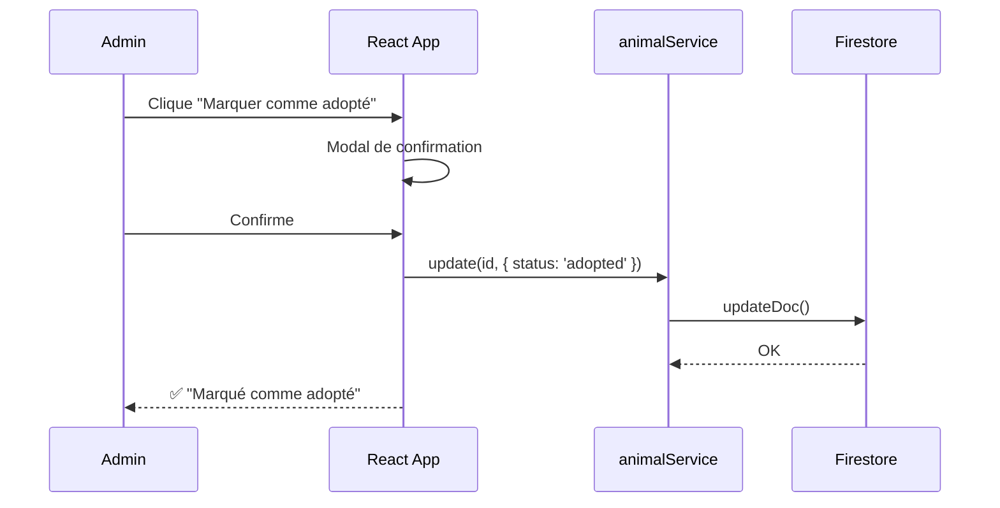
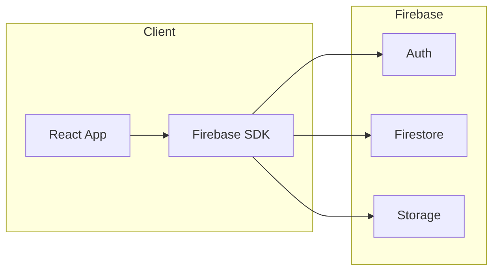
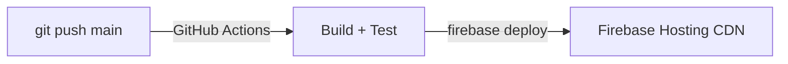

# SPA Pontarlier Website Redesign - Fullstack Architecture Document

## Introduction

Ce document décrit l'architecture complète fullstack pour le projet de refonte du site web de la SPA de Pontarlier. Il couvre les systèmes backend, l'implémentation frontend et leur intégration. Il sert de source unique de vérité pour le développement assisté par IA, garantissant la cohérence sur l'ensemble de la stack technologique.

Cette approche unifiée combine ce qui serait traditionnellement des documents d'architecture backend et frontend séparés, simplifiant le processus de développement pour cette application fullstack moderne où ces préoccupations sont intrinsèquement liées.

### Starter Template ou Projet Existant

**N/A - Projet Greenfield**

Le projet part de zéro avec la stack suivante :
- **Frontend :** React (Vite) + Tailwind CSS
- **Backend :** Firebase (Firestore, Auth, Storage, Hosting)

### Change Log

| Date | Version | Description | Author |
|------|---------|-------------|--------|
| 2026-01-18 | 1.0 | Architecture complète - approche pragmatique | Winston (Architect) |

---

## High Level Architecture

### Technical Summary

L'application adopte une **architecture Jamstack/Serverless** avec un frontend React hébergé sur Firebase Hosting et un backend entièrement géré par les services Firebase (Firestore, Authentication, Storage). Cette approche élimine la gestion de serveurs tout en offrant scalabilité et coût nul pour le volume attendu d'une SPA locale.

Le frontend React communique directement avec Firebase via le SDK client, sans couche API intermédiaire. L'authentification Firebase sécurise l'accès admin, tandis que les règles de sécurité Firestore protègent les données. Cette architecture minimaliste correspond parfaitement aux objectifs du projet : simplicité, autonomie de la SPA, et budget zéro.

### Platform and Infrastructure Choice

**Plateforme : Firebase (Google Cloud)**

| Service | Utilisation | Free Tier |
|---------|-------------|-----------|
| Firestore | Base de données NoSQL temps réel | 50K lectures/jour, 20K écritures/jour |
| Authentication | Auth email/password pour admin | Illimité |
| Storage | Photos des animaux | 5GB stockage, 1GB/jour download |
| Hosting | Hébergement statique + CDN + SSL | 10GB stockage, 360MB/jour transfer |

**Région :** europe-west1 (Belgique) - proximité avec Pontarlier

### Repository Structure

```
spaLandingPage/
├── src/
│   ├── components/        # Composants React réutilisables
│   ├── pages/             # Pages (public + admin)
│   ├── hooks/             # Custom hooks (useAuth, useAnimals, etc.)
│   ├── services/          # Services Firebase encapsulés
│   ├── context/           # React Context (AuthContext, etc.)
│   ├── types/             # TypeScript interfaces
│   ├── utils/             # Fonctions utilitaires
│   └── assets/            # Images, icônes statiques
├── public/                # Assets statiques (favicon, etc.)
├── docs/                  # Documentation BMAD
├── firestore.rules        # Règles de sécurité Firestore
├── storage.rules          # Règles de sécurité Storage
├── firebase.json          # Configuration Firebase
└── firestore.indexes.json # Index Firestore
```

### High Level Architecture Diagram



### Architectural Patterns

| Pattern | Description | Rationale |
|---------|-------------|-----------|
| **Jamstack** | Site statique + services backend managés | Performance optimale, pas de serveur, coût nul |
| **Component-Based UI** | Composants React réutilisables avec TypeScript | Maintenabilité, réutilisation public/admin |
| **Context API** | État global via React Context (auth, données) | Suffisant pour ce projet, évite la complexité Redux |
| **Repository Pattern** | Services Firebase encapsulés dans `/services` | Abstraction, testabilité, évolutivité |
| **Route-Based Splitting** | Lazy loading des pages admin | Bundle initial réduit pour visiteurs |

---

## Tech Stack

| Category | Technology | Version | Purpose | Rationale |
|----------|------------|---------|---------|-----------|
| Frontend Language | TypeScript | ^5.3 | Typage statique | Sécurité, autocomplétion, maintenabilité |
| Frontend Framework | React | ^18.2 | UI library | Écosystème mature, large communauté |
| Build Tool | Vite | ^5.0 | Dev server + bundler | Rapide, HMR instantané, moderne |
| CSS Framework | Tailwind CSS | ^3.4 | Styling utility-first | Productivité, design system intégré |
| UI Components | Headless UI | ^1.7 | Composants accessibles | Accessible, compatible Tailwind |
| Icons | Heroicons | ^2.0 | Icônes SVG | Intégration Tailwind native |
| State Management | React Context | Built-in | État global | Suffisant pour ce projet |
| Routing | React Router | ^6.20 | Navigation SPA | Standard, protected routes |
| Backend/BaaS | Firebase | ^10.7 | Backend-as-a-Service | Tout-en-un, free tier généreux |
| Database | Firestore | ^10.7 | NoSQL temps réel | Sync temps réel, offline support |
| Authentication | Firebase Auth | ^10.7 | Auth email/password | Simple, sécurisé, intégré |
| File Storage | Firebase Storage | ^10.7 | Photos animaux | CDN intégré, règles sécurité |
| Hosting | Firebase Hosting | ^10.7 | Hébergement statique | CDN global, SSL gratuit |
| Form Handling | React Hook Form | ^7.49 | Gestion formulaires | Performant, peu de re-renders |
| Form Validation | Zod | ^3.22 | Validation schémas | TypeScript-first |
| Image Optimization | browser-image-compression | ^2.0 | Compression client | Réduit taille avant upload |
| Date Handling | date-fns | ^3.0 | Manipulation dates | Léger, tree-shakable |
| Linting | ESLint | ^8.56 | Qualité code | Standard React/TypeScript |
| Formatting | Prettier | ^3.1 | Formatage code | Consistance |
| Testing | Vitest | ^1.1 | Tests unitaires | Compatible Vite, rapide |
| CI/CD | GitHub Actions | - | Déploiement auto | Gratuit, intégration GitHub |

---

## Data Models

### Animal

Représente un animal disponible à l'adoption (ou adopté/archivé).

```typescript
// src/types/animal.ts

export type Species = 'chien' | 'chat' | 'oiseau' | 'autre';
export type Gender = 'male' | 'female';
export type AnimalStatus = 'available' | 'adopted';

export interface AnimalCompatibility {
  children: boolean;      // OK avec enfants
  dogs: boolean;          // OK avec chiens
  cats: boolean;          // OK avec chats
  other_animals: boolean; // OK avec autres animaux
}

export interface Animal {
  id: string;
  name: string;
  species: Species;
  breed: string;                // Race (ex: "Labrador", "Siamois")
  age: string;                  // Âge approximatif (ex: "2 ans")
  birthDate: Date | null;       // Date de naissance (optionnel)
  gender: Gender;
  description: string;          // Description publique
  photos: string[];             // URLs Firebase Storage
  mainPhoto: string;            // URL photo principale
  compatibility: AnimalCompatibility;
  status: AnimalStatus;
  createdAt: Date;
  updatedAt: Date;
  // Note: adminNotes stocké séparément dans animals/{id}/private/notes
}

export type AnimalCreateInput = Omit<Animal, 'id' | 'createdAt' | 'updatedAt'>;
export type AnimalUpdateInput = Partial<AnimalCreateInput>;
```

### SpaInfo

Informations générales de la SPA (document singleton).

```typescript
// src/types/spaInfo.ts

export interface OpeningHours {
  monday: string | null;
  tuesday: string | null;
  wednesday: string | null;
  thursday: string | null;
  friday: string | null;
  saturday: string | null;
  sunday: string | null;
}

export interface SpaInfo {
  id: string;               // Toujours "main" (singleton)
  name: string;
  address: string;
  phone: string;
  email: string;
  hours: OpeningHours;
  description: string;      // Présentation générale
  adoptionProcess: string;  // Procédure d'adoption (Markdown)
  helpInfo: string;         // Comment aider (Markdown)
  updatedAt: Date;
}

export type SpaInfoUpdateInput = Omit<SpaInfo, 'id' | 'updatedAt'>;
```

### AnimalPrivateNotes (sous-collection sécurisée)

Notes internes admin, stockées séparément pour des raisons de sécurité.

```typescript
// src/types/animal.ts

// Document privé: animals/{id}/private/notes
export interface AnimalPrivateNotes {
  content: string;    // Notes admin (médical, comportement, rappels)
  updatedAt: Date;
}
```

**Chemin Firestore :** `animals/{animalId}/private/notes`

> **Note sécurité :** Ces données sont dans une sous-collection avec des règles restrictives. Seuls les admins authentifiés peuvent y accéder.

### Data Model Diagram



---

## API Specification (Firebase)

> **Note :** Ce projet utilise Firebase, pas une API REST. Le frontend communique directement avec Firestore via le SDK.

### Firestore Collections Structure

```
firestore/
├── animals/                    # Collection publique
│   └── {animalId}/
│       ├── [champs publics]    # Lisible par tous
│       └── private/            # Sous-collection protégée
│           └── notes           # Document admin-only
└── spaInfo/
    └── main                    # Document singleton
```

### Opérations par Collection

#### Collection `animals`

| Opération | Accès Public | Accès Admin |
|-----------|--------------|-------------|
| Lister les animaux disponibles | ✅ | ✅ |
| Voir détail animal | ✅ | ✅ |
| Filtrer par espèce/compatibilité | ✅ | ✅ |
| Créer un animal | ❌ | ✅ |
| Modifier un animal | ❌ | ✅ |
| Supprimer un animal | ❌ | ✅ |
| Lire notes privées | ❌ | ✅ |
| Modifier notes privées | ❌ | ✅ |

#### Collection `spaInfo`

| Opération | Accès Public | Accès Admin |
|-----------|--------------|-------------|
| Lire les infos SPA | ✅ | ✅ |
| Modifier les infos | ❌ | ✅ |

### Firestore Security Rules

```javascript
// firestore.rules
rules_version = '2';
service cloud.firestore {
  match /databases/{database}/documents {

    // ========== ANIMALS (PUBLIC DATA) ==========
    match /animals/{animalId} {
      // Lecture publique (données non sensibles)
      allow read: if true;

      // Écriture admin uniquement
      allow create: if request.auth != null
        && isValidAnimal(request.resource.data);
      allow update: if request.auth != null;
      allow delete: if request.auth != null;

      // ========== PRIVATE NOTES (ADMIN ONLY) ==========
      match /private/{docId} {
        allow read, write: if request.auth != null;
      }
    }

    // ========== SPA INFO ==========
    match /spaInfo/{docId} {
      allow read: if true;
      allow write: if request.auth != null && docId == 'main';
    }

    // ========== VALIDATION ==========
    function isValidAnimal(data) {
      return data.name is string && data.name.size() > 0
        && data.species in ['chien', 'chat', 'oiseau', 'autre']
        && data.gender in ['male', 'female']
        && data.status in ['available', 'adopted'];
    }
  }
}
```

### Firebase Storage Rules

```javascript
// storage.rules
rules_version = '2';
service firebase.storage {
  match /b/{bucket}/o {
    match /animals/{animalId}/{fileName} {
      allow read: if true;
      allow write: if request.auth != null
        && request.resource.size < 5 * 1024 * 1024
        && request.resource.contentType.matches('image/.*');
      allow delete: if request.auth != null;
    }
  }
}
```

---

## Components

### Structure des composants

```
src/components/
├── ui/                     # Composants UI réutilisables
│   ├── Button.tsx
│   ├── Card.tsx
│   ├── Input.tsx
│   ├── Select.tsx
│   ├── Modal.tsx
│   ├── Spinner.tsx
│   ├── Toast.tsx
│   └── Badge.tsx
├── layout/                 # Composants de mise en page
│   ├── Navbar.tsx          # + lien Login/Logout si admin
│   ├── Footer.tsx
│   ├── Container.tsx
│   └── PageHeader.tsx
├── animals/                # Composants liés aux animaux
│   ├── AnimalCard.tsx      # + boutons admin si connecté
│   ├── AnimalGrid.tsx
│   ├── AnimalFilters.tsx
│   ├── AnimalGallery.tsx
│   ├── AnimalEditModal.tsx # Modal création/édition
│   ├── PhotoUploader.tsx
│   └── CompatibilityBadges.tsx
├── categories/
│   └── CategoryCard.tsx
├── home/
│   ├── HeroCarousel.tsx
│   └── CTASection.tsx
├── spa/
│   └── SpaInfoEditModal.tsx # Modal édition infos SPA
└── auth/
    └── ProtectedAction.tsx  # Wrapper pour actions admin
```

### Services

```
src/services/
├── firebase.ts          # Configuration Firebase
├── animalService.ts     # CRUD animaux
├── spaInfoService.ts    # Gestion infos SPA
├── storageService.ts    # Upload/delete photos
└── authService.ts       # Authentification
```

| Service | Méthodes principales |
|---------|---------------------|
| `animalService` | `getAll()`, `getById()`, `create()`, `update()`, `delete()`, `getPrivateNotes()`, `updatePrivateNotes()` |
| `spaInfoService` | `get()`, `update()` |
| `storageService` | `uploadPhoto()`, `deletePhoto()`, `compressImage()` |
| `authService` | `login()`, `logout()`, `onAuthStateChanged()` |

### Pages

```
src/pages/
├── HomePage.tsx
├── AnimalsPage.tsx          # + bouton "Ajouter" si admin connecté
├── AnimalDetailPage.tsx     # + boutons "Modifier/Supprimer" si admin
├── AdoptionPage.tsx         # + bouton "Modifier" si admin
├── HelpPage.tsx             # + bouton "Modifier infos SPA" si admin
└── LoginPage.tsx            # Seule page "admin"
```

> **Note architecture simplifiée :** Pas de back-office séparé. L'admin voit le site public avec des boutons d'action supplémentaires. Les formulaires s'ouvrent dans des modales.

---

## Core Workflows

### Visiteur parcourt les animaux



### Admin ajoute un animal



### Admin archive un animal (adopté)



---

## Frontend Architecture

### Routing (simplifié)

```typescript
// src/App.tsx

import { BrowserRouter, Routes, Route } from 'react-router-dom';
import { AuthProvider } from '@/context/AuthContext';

import { HomePage } from '@/pages/HomePage';
import { AnimalsPage } from '@/pages/AnimalsPage';
import { AnimalDetailPage } from '@/pages/AnimalDetailPage';
import { AdoptionPage } from '@/pages/AdoptionPage';
import { HelpPage } from '@/pages/HelpPage';
import { LoginPage } from '@/pages/LoginPage';
import { NotFoundPage } from '@/pages/NotFoundPage';

export function App() {
  return (
    <BrowserRouter>
      <AuthProvider>
        <Routes>
          <Route path="/" element={<HomePage />} />
          <Route path="/animaux" element={<AnimalsPage />} />
          <Route path="/animaux/:id" element={<AnimalDetailPage />} />
          <Route path="/adoption" element={<AdoptionPage />} />
          <Route path="/aider" element={<HelpPage />} />
          <Route path="/login" element={<LoginPage />} />
          <Route path="*" element={<NotFoundPage />} />
        </Routes>
      </AuthProvider>
    </BrowserRouter>
  );
}
```

> **Note :** Pas de routes `/admin/*` protégées. L'authentification déverrouille les boutons d'action sur les pages existantes.

### State Management (React Context)

```typescript
// src/context/AuthContext.tsx

interface AuthContextType {
  user: User | null;
  loading: boolean;
  login: (email: string, password: string) => Promise<void>;
  logout: () => Promise<void>;
}

// Hook d'utilisation
export const useAuth = () => useContext(AuthContext);
```

**Patterns :**
- `AuthContext` : État utilisateur, méthodes login/logout
- `Props` : Données locales (animal, formulaires)
- `URL params` : Filtres (`/animaux?species=chien`)

### Admin Inline Pattern

```typescript
// Exemple: AnimalCard avec actions admin conditionnelles

export function AnimalCard({ animal }: { animal: Animal }) {
  const { user } = useAuth();
  const [showEditModal, setShowEditModal] = useState(false);

  return (
    <article className="card">
      {/* Contenu visible par tous */}
      
      <h3>{animal.name}</h3>

      {/* Actions admin - conditionnelles */}
      {user && (
        <div className="admin-actions">
          <Button onClick={() => setShowEditModal(true)}>Modifier</Button>
          <Button variant="success" onClick={handleMarkAdopted}>Adopté ✓</Button>
        </div>
      )}

      <AnimalEditModal
        animal={animal}
        isOpen={showEditModal}
        onClose={() => setShowEditModal(false)}
      />
    </article>
  );
}
```

### Firebase Service Layer

```typescript
// src/services/firebase.ts
export const db = getFirestore(app);
export const auth = getAuth(app);
export const storage = getStorage(app);

// src/services/animalService.ts
export const animalService = {
  getAvailable: () => Promise<Animal[]>,
  getById: (id: string) => Promise<Animal | null>,
  create: (data: AnimalCreateInput) => Promise<string>,
  update: (id: string, data: Partial<AnimalCreateInput>) => Promise<void>,
  delete: (id: string) => Promise<void>,
};
```

---

## Backend Architecture

> **Note :** Avec Firebase, il n'y a pas de backend traditionnel. Les services Firebase (Firestore, Auth, Storage) sont accédés directement via le SDK client.

### Architecture Serverless



### Firestore Index

```json
// firestore.indexes.json
{
  "indexes": [
    {
      "collectionGroup": "animals",
      "fields": [
        { "fieldPath": "status", "order": "ASCENDING" },
        { "fieldPath": "createdAt", "order": "DESCENDING" }
      ]
    }
  ]
}
```

### Authentication

- **Provider :** Email/Password uniquement
- **Comptes :** 1 compte admin créé manuellement dans Firebase Console
- **Inscription publique :** Désactivée

---

## Project Structure

```
spaLandingPage/
├── public/
│   ├── favicon.ico
│   └── robots.txt
├── src/
│   ├── assets/                    # Images statiques
│   ├── components/
│   │   ├── ui/                    # Button, Card, Input, Modal, Spinner, Toast, Badge
│   │   ├── layout/                # Navbar, Footer, Container, PageHeader
│   │   ├── animals/               # AnimalCard, AnimalGrid, AnimalFilters, AnimalEditModal, PhotoUploader
│   │   ├── categories/            # CategoryCard
│   │   ├── home/                  # HeroCarousel, CTASection
│   │   └── spa/                   # SpaInfoEditModal
│   ├── context/
│   │   └── AuthContext.tsx
│   ├── hooks/
│   │   ├── useAnimals.ts
│   │   ├── useSpaInfo.ts
│   │   └── useToast.ts
│   ├── pages/
│   │   ├── HomePage.tsx
│   │   ├── AnimalsPage.tsx
│   │   ├── AnimalDetailPage.tsx
│   │   ├── AdoptionPage.tsx
│   │   ├── HelpPage.tsx
│   │   ├── LoginPage.tsx
│   │   └── NotFoundPage.tsx
│   ├── services/
│   │   ├── firebase.ts
│   │   ├── animalService.ts
│   │   ├── spaInfoService.ts
│   │   ├── storageService.ts
│   │   └── authService.ts
│   ├── types/
│   │   ├── animal.ts
│   │   └── spaInfo.ts
│   ├── utils/
│   │   ├── formatters.ts
│   │   └── validators.ts
│   ├── App.tsx
│   ├── main.tsx
│   └── index.css
├── docs/                          # Documentation BMAD
├── .env.example
├── firebase.json
├── firestore.rules
├── firestore.indexes.json
├── storage.rules
├── package.json
├── tailwind.config.js
├── tsconfig.json
└── vite.config.ts
```

### Configuration Firebase

```json
// firebase.json
{
  "hosting": {
    "public": "dist",
    "rewrites": [{ "source": "**", "destination": "/index.html" }]
  },
  "firestore": { "rules": "firestore.rules", "indexes": "firestore.indexes.json" },
  "storage": { "rules": "storage.rules" }
}
```

### Variables d'environnement

```bash
# .env.example
VITE_FIREBASE_API_KEY=xxx
VITE_FIREBASE_AUTH_DOMAIN=xxx.firebaseapp.com
VITE_FIREBASE_PROJECT_ID=xxx
VITE_FIREBASE_STORAGE_BUCKET=xxx.appspot.com
VITE_FIREBASE_MESSAGING_SENDER_ID=xxx
VITE_FIREBASE_APP_ID=xxx
```

---

## Development Workflow

### Prérequis

```bash
node >= 18.0.0
npm >= 9.0.0
npm install -g firebase-tools
```

### Installation

```bash
# Cloner et installer
git clone <repo-url> && cd spaLandingPage
npm install

# Configurer Firebase
cp .env.example .env.local   # Remplir avec valeurs Firebase Console
firebase login
firebase use --add           # Sélectionner le projet
```

### Commandes principales

| Commande | Description |
|----------|-------------|
| `npm run dev` | Serveur de dev (localhost:5173) |
| `npm run build` | Build de production |
| `npm run lint` | Vérification ESLint |
| `npm run test` | Tests Vitest |
| `npm run deploy` | Build + déploiement Firebase |

### Commandes Firebase

```bash
firebase deploy --only hosting      # Déployer le site
firebase deploy --only firestore    # Déployer les règles Firestore
firebase deploy --only storage      # Déployer les règles Storage
firebase deploy                     # Tout déployer
```

---

## Deployment

### Stratégie



### Déploiement manuel

```bash
npm run deploy   # Build + deploy Firebase Hosting
```

### CI/CD (GitHub Actions)

```yaml
# .github/workflows/deploy.yml
name: Deploy
on:
  push:
    branches: [main]

jobs:
  deploy:
    runs-on: ubuntu-latest
    steps:
      - uses: actions/checkout@v4
      - uses: actions/setup-node@v4
        with:
          node-version: '20'
          cache: 'npm'
      - run: npm ci
      - run: npm run lint
      - run: npm run test -- --run
      - run: npm run build
        env:
          VITE_FIREBASE_API_KEY: ${{ secrets.VITE_FIREBASE_API_KEY }}
          VITE_FIREBASE_AUTH_DOMAIN: ${{ secrets.VITE_FIREBASE_AUTH_DOMAIN }}
          VITE_FIREBASE_PROJECT_ID: ${{ secrets.VITE_FIREBASE_PROJECT_ID }}
          VITE_FIREBASE_STORAGE_BUCKET: ${{ secrets.VITE_FIREBASE_STORAGE_BUCKET }}
          VITE_FIREBASE_MESSAGING_SENDER_ID: ${{ secrets.VITE_FIREBASE_MESSAGING_SENDER_ID }}
          VITE_FIREBASE_APP_ID: ${{ secrets.VITE_FIREBASE_APP_ID }}
      - uses: FirebaseExtended/action-hosting-deploy@v0
        with:
          repoToken: ${{ secrets.GITHUB_TOKEN }}
          firebaseServiceAccount: ${{ secrets.FIREBASE_SERVICE_ACCOUNT }}
          channelId: live
          projectId: ${{ secrets.VITE_FIREBASE_PROJECT_ID }}
```

### URLs

| Environnement | URL |
|---------------|-----|
| Production | `https://<project-id>.web.app` |
| Custom domain (optionnel) | `https://spa-pontarlier.fr` |

---

## Security & Performance

### Security

| Couche | Protection |
|--------|------------|
| Firestore | Rules côté serveur - lecture publique, écriture auth required |
| Firestore (private) | Sous-collection `private/` - auth required pour tout |
| Storage | Rules - upload auth + validation (5MB max, images only) |
| Auth | Email/password, pas d'inscription publique |
| Hosting | HTTPS forcé automatiquement |

> **Note importante :** Les Firebase Rules sont exécutées **côté serveur Firebase**, pas dans le navigateur. La config client (`apiKey`, etc.) identifie le projet mais ne donne aucun accès privilégié. La sécurité repose entièrement sur les rules déployées.

**Vigilance PR :** Toujours review attentivement les modifications sur `firestore.rules` et `storage.rules`.

### Performance

| Technique | Implémentation |
|-----------|----------------|
| Image Compression | `browser-image-compression` avant upload (max 1MB) |
| Lazy Loading | `loading="lazy"` sur les images |
| Bundle Optimization | Tailwind purge CSS auto en prod |
| Firestore Cache | SDK gère le cache automatiquement |

**Targets :**
- Lighthouse Performance > 80
- First Contentful Paint < 1.5s
- Bundle size < 200KB gzipped

---

## Testing Strategy

### Approche minimaliste (pragmatique)

| Ce qu'on fait | Ce qu'on skip |
|---------------|---------------|
| ✅ ESLint | ❌ Tests unitaires |
| ✅ TypeScript (typage) | ❌ Tests de composants |
| ✅ Zod (validation formulaires) | ❌ Tests E2E |
| ✅ Test manuel avant deploy | ❌ Coverage |

**Rationale :** Projet d'apprentissage sans maintenance active prévue. TypeScript + ESLint + validation Zod = filet de sécurité suffisant.

### Checklist manuelle avant deploy

- [ ] Page d'accueil s'affiche
- [ ] Liste des animaux fonctionne
- [ ] Fiche animal s'ouvre
- [ ] Connexion admin fonctionne
- [ ] CRUD animaux fonctionne
- [ ] Upload photos fonctionne

---

## Coding Standards

### Règles essentielles

| Règle | Pourquoi |
|-------|----------|
| TypeScript strict | Évite les bugs à la compilation |
| ESLint + Prettier | Code consistant sans effort |
| Composants fonctionnels | Standard React moderne |
| Services pour Firebase | Jamais d'appel Firestore direct dans les composants |

### Conventions de nommage

| Élément | Convention | Exemple |
|---------|------------|---------|
| Composants | PascalCase | `AnimalCard.tsx` |
| Hooks | camelCase + use | `useAnimals.ts` |
| Services | camelCase | `animalService.ts` |
| Types/Interfaces | PascalCase | `Animal`, `SpaInfo` |

### Structure d'un composant

```typescript
import { Animal } from '@/types/animal';

interface Props {
  animal: Animal;
}

export function AnimalCard({ animal }: Props) {
  return (
    <article className="bg-white rounded-lg shadow">
      
      <h3>{animal.name}</h3>
    </article>
  );
}
```

### Ce qu'on évite

| ❌ Éviter | ✅ Préférer |
|-----------|-------------|
| `any` | Types explicites |
| Classes React | Fonctions + hooks |
| CSS modules | Tailwind classes |
| Firebase dans composants | Via services |
| Redux | Context + props |

---

## Summary

**Projet :** SPA Pontarlier Website Redesign

**Stack :** React + TypeScript + Tailwind CSS + Firebase

**Architecture :**
- Frontend-only (pas de backend custom)
- Firebase comme BaaS (Firestore, Auth, Storage, Hosting)
- Admin inline (pas de back-office séparé)
- Security via Firebase Rules côté serveur

**Approche :** Pragmatique, simple, maintenable par un non-technique (côté admin).

---

*Document généré avec la méthodologie BMAD™*
